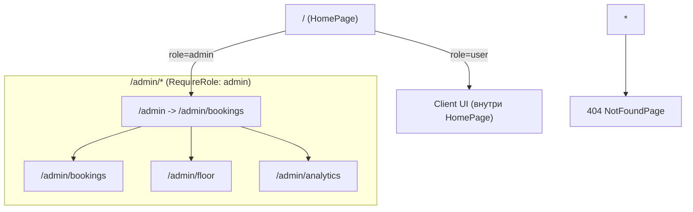

# Архитектура Front-End

Проект — SPA на React + TypeScript (Vite). Цель архитектуры — разделение ответственности между страницами, бизнес-логикой (сервисами), переиспользуемыми UI-компонентами и провайдерами.

## Структура модулей

```
src/
  app/
    providers/            # провайдеры и инфраструктура (Router, Toast, AppState, ErrorBoundary)
    styles/               # глобальные стили и переменные
  pages/                  # контейнеры-страницы (роуты)
  widgets/                # крупные композиции (флоу бронирования, мои брони)
  features/               # фичи (role selection и т.д.)
  shared/
    api/                  # mock API + типы данных
    lib/                  # хуки, утилиты, toast, логирование
    ui/                   # переиспользуемые UI-компоненты (Button, Card, Dialog...)
```

## Компоненты / Pages / Services / Hooks

- **UI компоненты**: `src/shared/ui/*` — кнопки, карточки, диалоги, инпуты.
- **Pages**: `src/pages/*` — контейнеры для маршрутов (home, admin/*, not-found).
- **Widgets**: `src/widgets/*` — готовые сценарии, состоящие из UI и бизнес-логики (BookingFlow, MyBookings).
- **Services (API)**: `src/shared/api/mockData.ts` — единая точка работы с данными (mock), имитирует запросы, хранит состояние схемы зала в `localStorage`.
- **Hooks**: `src/shared/lib/hooks/*` — telegram hook, toast, mobile.

## Управление состоянием

1) **Локальное состояние** — `useState/useMemo/useEffect` внутри страниц/виджетов:
- UI-фильтры, формы, открытие модалок, шаги флоу бронирования.

2) **Глобальное состояние** — `AppStateProvider`:
- `src/app/providers/app-state/*` хранит роль пользователя (`user/admin`) и сохраняет её в `localStorage`.
- Роль используется в `RequireRole` (guard для роутов админа).

## Роутинг

Роутинг построен на React Router (nested routes + guard):



## Инженерная культура

- ESLint (flat-config) — `eslint.config.js`
- Типизация API и состояния — `src/shared/api/types.ts`
- Глобальная обработка UI ошибок — `src/app/providers/error-boundary/*`
- Skeleton/loading states — в виджетах и страницах (списки/загрузка схемы/аналитики)

